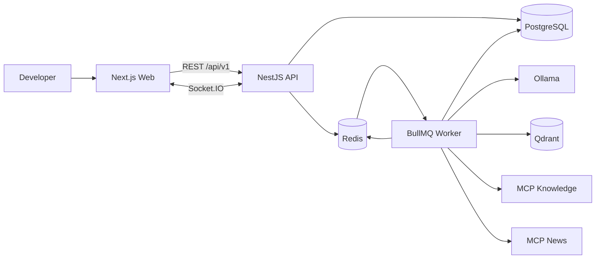

# Architecture

## System Context

The browser communicates with a NestJS API over versioned REST and Socket.IO.
The API persists intent in PostgreSQL and schedules long-running work in
BullMQ. Workers call Ollama, Qdrant, and MCP servers, persist every run step,
and publish progress through Redis so the API gateway can update subscribed
browsers.



## Monorepo Shape

```text
apps/
  web/
  api/
  worker/
  mcp-knowledge/
  mcp-news/
packages/
  contracts/
  domain/
  ai/
  rag/
  mcp/
  ui/
  config/
```

Turborepo coordinates builds while npm workspaces own dependency resolution.
Applications are independently runnable processes. Shared packages contain
contracts and reusable logic, not framework-specific shortcuts.

## Bounded Contexts

- Identity and Tenancy: users, tenants, memberships, roles, sessions.
- Agent Configuration: prompts, models, tools, knowledge bases, limits.
- Conversation: conversations, messages, attachments.
- Agent Runtime: runs, steps, tool calls, cancellation, state transitions.
- Knowledge: documents, chunks, embeddings, retrieval, citations.
- Integrations: MCP connections, discovered tools, permissions, audit data.
- Usage: token accounting, latency, costs, limits.
- Evaluation: golden cases, evaluation runs, results.

## Runtime Flow

1. The API authenticates the request and derives user and tenant context.
2. It creates an `AgentRun` transactionally and enqueues `run-agent`.
3. The worker claims the job using an idempotent job identifier.
4. The runner loads the agent definition and authorized resources.
5. It performs optional tenant-filtered retrieval and invokes Ollama.
6. Validated MCP calls run through an allowlisted tool registry.
7. Every operation creates or completes an `AgentRunStep`.
8. Usage and errors are persisted before an event is published.
9. The UI combines Socket.IO events with REST snapshots for recovery.

## Deployment Boundary

Version 0.1.0 is local-only. PostgreSQL, Redis, and Qdrant run in Docker
Compose; Ollama runs on the host for GPU access. RabbitMQ and cloud deployment
remain explicit future decisions.

Next.js, NestJS, and the worker also run on the host during development for
fast reloads. Production application images are deferred until a deployment
target exists; this does not change the application boundaries or Compose-based
stateful dependencies.
