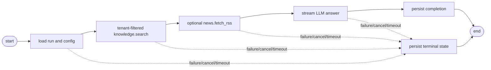

# LangChain and LangGraph

## Runtime Boundary

The platform uses LangGraph to make agent execution visible as a graph while
keeping the existing platform boundaries intact. The graph runs inside
`apps/worker` after BullMQ claims a durable `run-agent` job. The API still
authenticates users, derives tenant context, creates `AgentRun` records, and
publishes REST snapshots. PostgreSQL remains the source of truth for run state,
step state, usage, and auditability.

LangChain is introduced as a set of primitives, not as the main application
runtime. The project keeps its own `LlmProviderPort`, `ToolRegistryPort`,
contracts, repositories, and realtime events because those are the educational
surfaces this repository is meant to demonstrate. LangGraph gives the worker a
clear control-flow model without hiding tenant checks, budget enforcement, MCP
validation, or persistence behind a hosted agent service.

The initial graph mirrors the current runner:

Every node that performs work goes through the same step helper used by the
current worker. A graph node may decide whether to skip or execute a step, but
it may not write model-visible secrets, bypass tool allowlists, or trust
browser-supplied resource ownership. Node output is summarized into bounded
previews before it is persisted or emitted.

## Migration Shape

The first code migration should add a graph builder next to the existing
`AgentRunProcessor` and make `processAgentRun` invoke the compiled graph. The
public processor entrypoint should not change. Tests that currently exercise
retrieval, RSS, LLM streaming, cancellation, timeout, retry count, and budget
failure become regression tests for graph behavior.

The graph state should contain only execution data required between nodes:
tenant context, run ID, parsed input, config snapshot, accumulated tool output
previews, token count, tool-call count, timeout signal, and terminal failure
metadata. It should not duplicate full database rows, raw document chunks, RSS
payload bodies, Gmail bodies, OAuth tokens, or provider credentials.

LangGraph streaming is used only if it helps map node updates back to the
existing `RealtimeEventPublisher`. Model token streaming continues to come from
`LlmProviderPort.streamChat` so Ollama and fake provider tests remain stable.
LangGraph checkpointers are documented as a future option, but PostgreSQL
`AgentRunStep` rows continue to provide retry and recovery semantics.

## Default Agents

Default agents are code-owned templates that can be installed for a tenant.
They are not special runtime classes. Each template declares its prompt, model
defaults, limits, enabled tools, and required connection state. When a tenant
lacks a required connection, the UI should show setup status instead of letting
the agent fail late.

The first template set is:

| Template | Purpose | Required tools or connections |
| --- | --- | --- |
| Knowledge Researcher | Answer questions from uploaded knowledge with citations. | `knowledge.search` |
| Daily News Briefing | Summarize configured RSS feeds with links. | `news.fetch_rss`, tenant news feeds |
| Gmail Triage | Read recent threads and produce a priority summary. | Gmail connection |
| Gmail Reply Assistant | Draft a response for review, edit, and user-approved send. | Gmail connection |
| Usage Analyst | Summarize token usage, latency, and budget pressure. | usage summary capability |

Templates are installed during tenant creation and can be reinstalled by an
owner or admin. Reinstalling templates should be idempotent: existing
user-edited agents are not overwritten unless the reset endpoint explicitly
targets a template-owned definition.

## Gmail Workflow

Gmail starts as a review-first workflow. The model may summarize threads and
propose replies, but it may not send mail directly. The application creates or
updates a Gmail draft, stores a local review record, and requires the user to
inspect recipients, subject, and body before sending from the web UI.

The local Gmail MCP server should expose narrowly scoped tools for search/list
threads, get thread, create draft, and update draft. Sending remains an API
action guarded by the review record and the authenticated user, not a model
callable MCP tool. A later auto-send mode must be disabled by default and must
require explicit UI confirmation, sender allowlists, category restrictions, and
auditable policy decisions.

OAuth credentials belong to the authenticated user and active tenant. Refresh
tokens must be encrypted at rest, never returned to the browser, never exposed
in prompts, and never included in logs, WebSocket payloads, run-step previews,
or audit metadata. Gmail message bodies are untrusted external content and must
be bounded before use in prompts or previews.

## News and Usage

RSS remains the first news provider because it is easy to demonstrate locally
and already fits the MCP model. Tenant-owned feed configuration should add a
name, URL, topic, enabled flag, and last fetch metadata. The news graph path
fetches selected feeds, treats entries as untrusted content, and asks the model
for a briefing with source links.

Usage analysis reads persisted usage rows only. It should not estimate cost or
token counts from prompt text. The dashboard API should return totals by period,
agent, run, provider, and model so the UI can show spend, latency, expensive
runs, and budget warnings without asking the model to calculate authoritative
numbers.

## Dashboard Home

The authenticated landing page becomes the command center for daily work. The
first viewport should combine the chat composer, selected agent, knowledge
status, Gmail review queue, news briefing, token usage, and recent run
timeline. Agents, Knowledge, Runs, and Settings remain separate workspaces for
configuration and diagnostics.

The UI must stay server-authoritative. Hidden client state cannot grant access
to Gmail actions, news feeds, documents, runs, or usage. Every widget needs
loading, empty, error, and unauthorized states because many integrations will be
optional during local learning.
