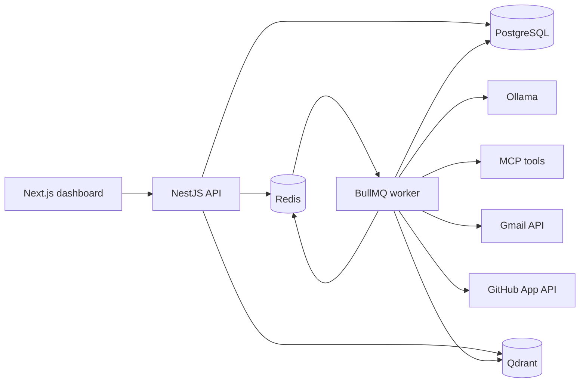

# Portfolio Release

`v0.1.0` is the local-first portfolio release for DevHub AI Command Center. It
shows the complete learning path for a small multi-tenant agent platform without
depending on cloud model APIs.

## Release Slice

The release includes tenant registration, JWT and refresh-token rotation, agent
configuration, Ollama chat, document ingestion, embeddings, Qdrant retrieval,
MCP tools, Gmail draft review, GitHub App repository reads and reviewed write
drafts, RSS news briefings, durable BullMQ runs, Socket.IO timelines, saved
workflow execution, usage budgets, full-runtime golden-set evaluation,
structured request logs, rate limits, upload hardening, and tenant audit views.

The demo runs locally through Docker Compose for PostgreSQL, Redis, and Qdrant.
Next.js, the API, the worker, MCP servers, Gmail and GitHub OAuth callbacks,
GitHub webhook handling, and Ollama run on the host to keep iteration fast and
GPU access simple.

## Hardening Notes

Rate limiting is an in-memory process guard intended for the local MVP. It
limits requests by IP, method, and path and returns the same error envelope as
the rest of the API. A production deployment should replace it with a shared
Redis-backed limiter so multiple API instances enforce one budget.

Structured request logs are JSON and include correlation ID, method, path,
status, and duration. They deliberately avoid request bodies, cookies,
authorization headers, refresh tokens, prompts, uploaded document text, and tool
outputs.

The audit view stores tenant-scoped security events for resource mutations,
search actions, OAuth connect/disconnect, GitHub installation sync, reviewed
external actions, and worker MCP tool calls. It records action, resource type,
resource ID, metadata, and timestamp. Browser-supplied tenant IDs are never
accepted, and Gmail/GitHub tool payloads are redacted before audit persistence.

Upload hardening keeps the allowlist narrow: Markdown, text, PDF, JPEG, PNG,
and WebP. Filenames are display metadata, storage keys are generated, PDF files
need the `%PDF-` signature, text files must be valid UTF-8 without binary NUL
bytes, and images route through the OCR provider before indexing.

## Trade-Offs

Deployment, SSO, organization invitations, billing, hosted observability,
distributed rate limiting, full RBAC policy editing, arbitrary user code in
workflows, and arbitrary external tool execution are intentionally left outside
`v0.1.0`. The release favors explicit ports, queues, DTOs, and repositories so a
reader can trace every behavior from browser request to database record.

The golden evaluator keeps a fast rule-based mode and adds a full-runtime mode.
The fast mode is repeatable and easy to audit, while full-runtime evaluation
executes the same durable LangGraph path used by the command center. A future
release can add model-graded evaluation as a separate evaluator type without
replacing the deterministic baseline.

Screenshots should be captured from a local run before tagging: Home command
center, Agents setup state, Integrations, Knowledge upload and retrieval, Runs
timeline, Usage, Gmail review queue, GitHub repository and action-review flows,
News feeds, Workflow editor, Audit log, and Evaluation report. The demo script
in [demo-script.md](demo-script.md) defines the capture path.
